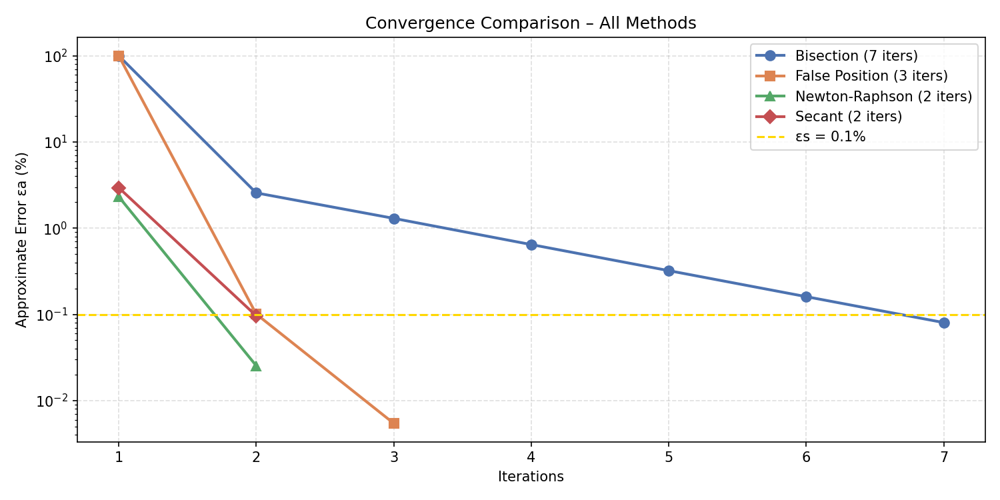

# Root-Finding Methods – Numerical methods

## Problem

Find the root of:

$$f(x) = \sin(x) + \cos(1 + x^2) - 1$$

on the interval $[1.8,\ 2.0]$, using a stopping criterion of $\varepsilon_s = 0.1\%$.

---

## Results

| Method         | Root         | Iterations |
|----------------|--------------|------------|
| Bisection      | 1.94531250   | 7          |
| False Position | 1.94460842   | 3          |
| Newton-Raphson | 1.94460843   | 2          |
| Secant         | 1.94462448   | 2          |
| SciPy brentq   | 1.94460843   | —          |

The reference (true) root computed by SciPy's `brentq` is **≈ 1.94460843**.

---

## Method Explanations

### Bisection
Repeatedly halves the interval $[a, b]$ and keeps the sub-interval where a sign change occurs. Guaranteed to converge but slow — it took **7 iterations** and its final root (1.94531250) is the least accurate, differing from the true root at the 4th decimal place.

### False Position 
Similar to bisection but uses a linear interpolation between $f(a)$ and $f(b)$ to pick the next estimate instead of the midpoint. Converged in **3 iterations** with a root of 1.94460842 — much closer to the true value.

### Newton-Raphson
Uses the derivative $f'(x)$ to find the tangent line at each iterate and jumps to its x-intercept:

$$x_{n+1} = x_n - \frac{f(x_n)}{f'(x_n)}$$

Converged in just **2 iterations** to 1.94460843, matching the reference root to 8 decimal places. Fastest convergence (quadratic) when started close to the root.

### Secant Method
Approximates the derivative using two previous points instead of an analytical formula:

$$x_{n+1} = x_n - f(x_n)\frac{x_n - x_{n-1}}{f(x_n) - f(x_{n-1})}$$

Also converged in **2 iterations** to 1.94462448. Slightly less accurate than Newton-Raphson here because it uses a finite-difference approximation of the derivative.

---

## Convergence Graph

The plot (`graph.png`) shows the approximate relative error $\varepsilon_a$ (%) versus iteration number on a semi-log scale for each method.

**Key observations:**

- **Bisection** (blue circles) decreases error slowly and steadily — linear convergence, ~1 bit of accuracy per iteration.
- **False Position** (orange squares) drops sharply within 3 iterations, outperforming bisection significantly.
- **Newton-Raphson** (green triangles) shows the steepest drop — quadratic convergence means the error roughly squares each step.
- **Secant** (red diamonds) nearly matches Newton-Raphson with only 2 iterations, requiring no analytical derivative.
- The gold dashed line marks the $\varepsilon_s = 0.1\%$ threshold; all methods stop once they cross below it.

---

Newton-Raphson and Secant both reach the answer in 2 iterations. Newton-Raphson is slightly more accurate but requires computing $f'(x)$ analytically. The Secant method achieves nearly the same speed without needing a derivative, making it preferable when differentiation is costly or unavailable.
